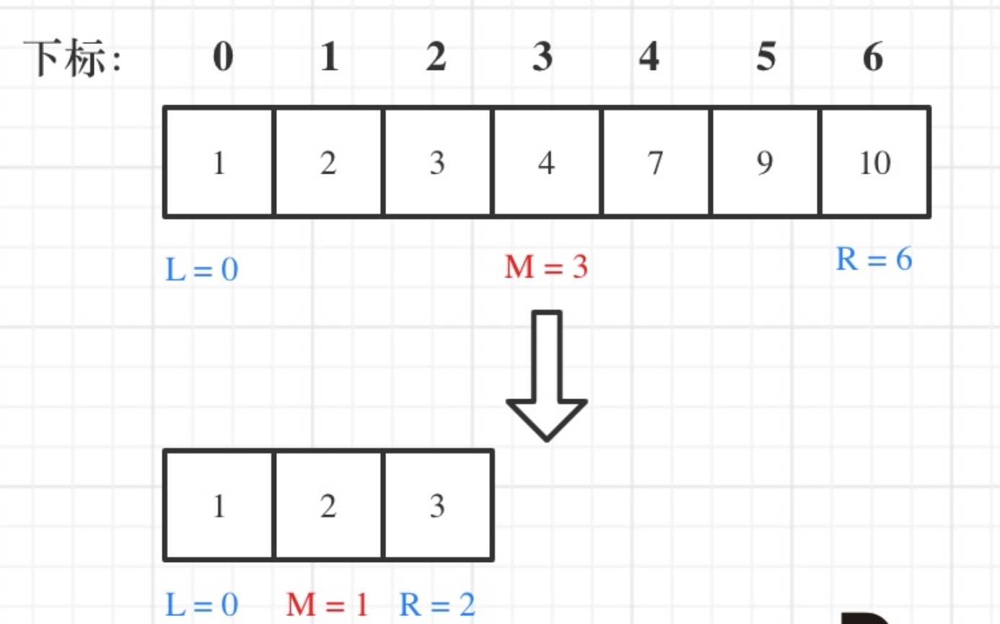
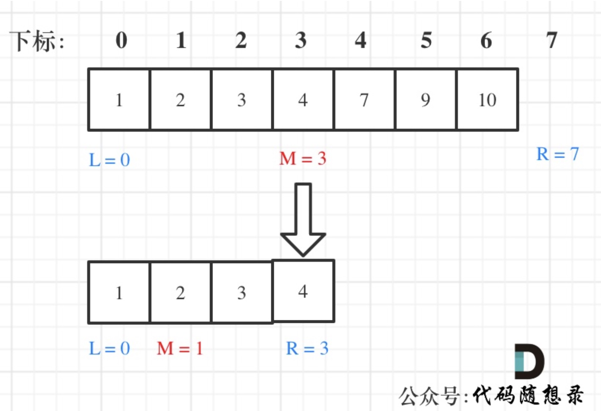
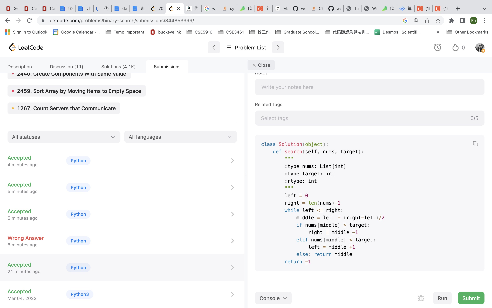

## Binary Search Basics

1. Binary search has to work on _**Ordered Array**_ and _**No Repeating Elements**_ in the array. 

2. Binary search has to define _**Interval**_ - **左闭右闭 [left, right] _or_ 左闭右开 [left, right)** and stick to _**Loop Invariant Principle**_

3. Binary search has to prevent **overflow** when performing addition of left and right index 

    [ Instead of `middle = (left+right)/2`, do `middle = left + ((right-left)/2)` ]

### 704. Binary-search

Given an array of integers `nums` which is sorted in ascending order, and an integer `target`, write a function to search `target` in `nums`. If `target` exists, then return its index. Otherwise, return `-1`.

You must write an algorithm with `O(log n)` runtime complexity.

Examples:

```
Input: nums = [-1,0,3,5,9,12], target = 9
Output: 4
Explanation: 9 exists in nums and its index is 4

Input: nums = [-1,0,3,5,9,12], target = 2
Output: -1
Explanation: 2 does not exist in nums so return -1
```

#### Binary-search first approach: 左闭右闭 [left, right]

1. While (left **<=** right) has to use **<=**, since left == right is legit in [left, right]
2. if (nums[middle} > target) & if (nums[middle} < target)  **right = middle +1** & **left = middle -1**, since nums[middle] is not the target

<p align="center">
    
</p>
```python
class Solution(object):
    def search(self, nums, target):
        left = 0
        right = len(nums)-1 #define target in the closed interval [left,right]
        while left <= right: #when left==right, [left,right] inveral is still legal, so use <=
            middle = left + (right-left)/2 #equal to (left+right)/2, prevent overflow 
            if nums[middle] > target:
                right = middle -1 #target is in [left,middle-1]
            elif nums[middle] < target:
                left = middle +1 #target is in [middle+1,left]
            else: return middle #find target
        return -1
```

#### Binary-search second approach: 左闭右开 [left, right)

1. While (left **<** right) has to use **<**, since left == right is not legit in [left, right)
2. if (nums[middle} > target) & if (nums[middle} < target) **right = middle+1** since nums[middle] is not the target & **left = middle** since nums[middle] will not be examined in the next interval 

<p align="center">
    
</p>

```python
class Solution(object):
    def search(self, nums, target):
        left = 0
        right = len(nums) #define target in the closed interval [left,right]
        while left < right: #when left==right, [left,right] inveral is still legal, so use <=
            middle = left + ((right - left) >> 1) #shift right 1 bit equal to (right-left)/2
            if nums[middle] > target:
                right = middle #target is in [left,middle-1]
            elif nums[middle] < target:
                left = middle +1 #target is in [middle+1,left]
            else: return middle #find target
        return -1
```

Submission Proof

<p align="center">
    
</p>


